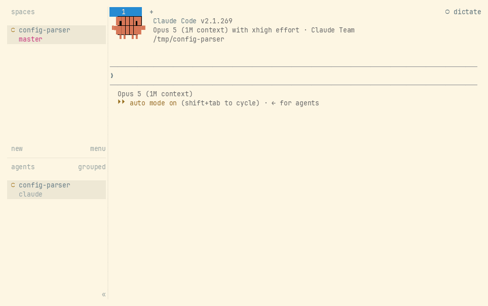

<div align="center">

# herdr-dictate

**Speak into any pane.** Local speech-to-text for [Herdr](https://herdr.dev): press a key, talk, and
the transcript is typed where you were looking.

[](https://github.com/abhishekrana/herdr-dictate/actions/workflows/ci.yml)
[](https://github.com/abhishekrana/herdr-dictate/releases)
[](LICENSE)


[Install](#install) · [Usage](#usage) · [Configuration](#configuration) ·
[Troubleshooting](#troubleshooting)

</div>



Audio never leaves the machine. whisper.cpp is compiled in, the model is downloaded and verified by
the plugin, and the model server is this same binary - there is no sidecar to install and nothing to
run yourself. A GPU is used automatically when one is present.

## Install

```sh
herdr plugin install abhishekrana/herdr-dictate
herdr plugin pane open --plugin abhishekrana.dictate --entrypoint setup
```

Herdr plugins cannot register their own keys, so `setup` offers to add them: `prefix+v` dictates,
`prefix+shift+v` dictates and submits. It backs up `config.toml` and appends rather than rewriting,
so comments survive.

Installing downloads a prebuilt binary when one fits this machine, and compiles otherwise. To
compile, run `scripts/install-deps.sh` first (Debian and Ubuntu) for the build tools and the audio
and GPU headers.

## Usage

Press the key, speak, then press it again. Or just stop talking - a couple of seconds of silence
ends the recording on its own. The first dictation downloads the model, so it takes noticeably
longer than every one after it.

| action        | what it does                                       |
| ------------- | -------------------------------------------------- |
| `toggle`      | start recording, or stop and insert the transcript  |
| `toggle-send` | the same, then press Enter once the transcript lands |
| `doctor`      | check every dependency and say what to do about it  |

Any desktop shortcut can start a dictation, whether or not Herdr has focus - bind this command:

```sh
herdr plugin action invoke abhishekrana.dictate.toggle-send
```

On GNOME that is Settings → Keyboard → Custom Shortcuts. A single key works, a bare modifier
included. Name `herdr` by its full path: a shortcut does not run with a login shell's `PATH`.

### Status chip

`status` prints one chip for Herdr's tab bar, so the state shows in every workspace - `○` idle, `●`
recording, `◌` while the model runs. `doctor` prints the line to paste:

```toml
# ~/.config/herdr/config.toml, under [ui]
tab_bar_right = [
  { type = "command", command = "/path/to/herdr-dictate status", interval_seconds = 1 },
]
```

## Configuration

Optional, at `config.toml` in `herdr plugin config-dir abhishekrana.dictate`:

```toml
[engine.model]
name = "small.en-q8_0"       # tiny.en, base.en, base.en-q8_0, small.en-q8_0, small.en

[silence]
threshold = 300.0            # how loud audio must be to count as speech
trailing_secs = 2.0          # seconds of silence that end a recording; 0 to never stop on its own
```

Models download on first use and are checked against a known hash. The default, `small.en-q8_0`, is
252 MB; `tiny.en` is 74 MB and noticeably worse. A `q8_0` model is a compressed build of the same
size class - half the download, faster, and no accuracy difference observed.

<details>
<summary>Every setting, with defaults</summary>

```toml
[engine]
language = "en"
threads = 0                  # 0 = one per core
prompt = "Terms: worktree, kubectl, herdr."   # biases the vocabulary

[engine.model]
name = "small.en-q8_0"
# path = "/models/ggml-medium.en.bin"      # a local file, used as-is
# url = "https://.../ggml-large-v3.bin"    # any ggml model
# sha256 = "..."                           # required with url

[silence]
threshold = 300.0
trailing_secs = 2.0
max_secs = 120.0            # a recording never runs longer than this

[server]
enabled = true
idle_secs = 300              # 0 keeps the model resident forever

[status]                     # what the tab bar chip reads, printed verbatim
idle = "○ dictate"
recording = "● dictate"
transcribing = "◌ dictate"
```

`name`, `path` and `url` are alternatives; set exactly one.

</details>

## Troubleshooting

```sh
herdr plugin action invoke abhishekrana.dictate.doctor
herdr plugin log list --plugin abhishekrana.dictate
```

`doctor` names each dependency, what it found and what to do about it. It listens briefly to
compare the room against the speech threshold: if it reports a room louder than `threshold`, the
recording never hears silence, so it will not stop on its own until you raise that number.

`HERDR_DICTATE_LOG=debug` increases logging.

**Linux only** - the audio capture path does not handle macOS sample rates yet.

## License

MIT - see [LICENSE](LICENSE).
